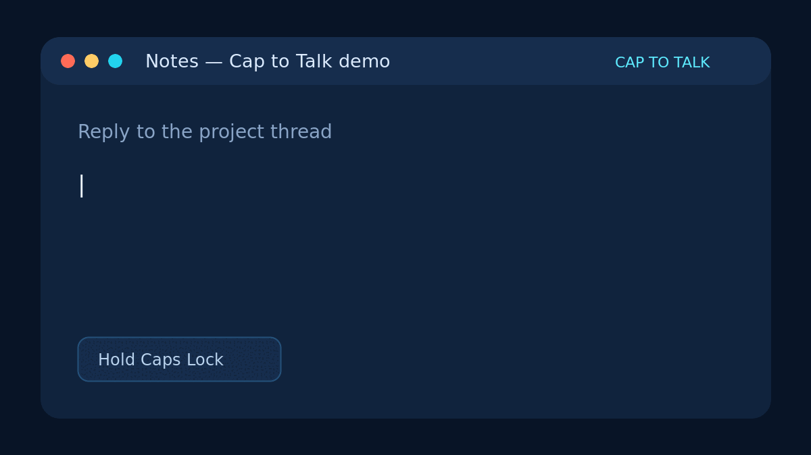
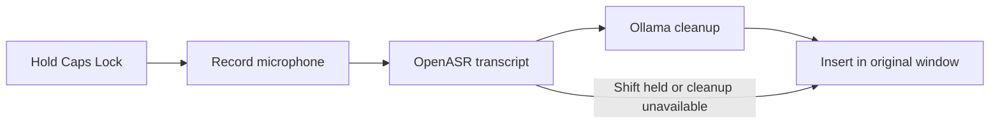

<div align="center">
  
  <h1>Caps Talk</h1>
  <p><strong>Hold Caps Lock. Speak. Release. Keep typing.</strong></p>
  <p>Private-by-default push-to-talk dictation for Linux/X11, powered by local AI.</p>

  [](https://github.com/farrantch/caps-talk/actions/workflows/ci.yml)
  [](https://github.com/farrantch/caps-talk/releases/latest)
  [](LICENSE)
  
</div>



Caps Talk turns Caps Lock into a system-wide dictation key. It records while
the key is held, transcribes with [OpenASR](https://github.com/QuintinShaw/openasr),
optionally cleans up the wording with [Ollama](https://ollama.com/), and inserts
the result into the window where you started speaking. The default setup runs
entirely on your machine and needs no cloud API key.

## Highlights

- **Natural push-to-talk:** hold Caps Lock to record and release to insert.
- **Two modes:** Caps Lock cleans up the transcript; Shift + Caps Lock inserts
  the raw transcription.
- **Local processing:** default OpenASR and Ollama endpoints use loopback only.
- **Right-window insertion:** remembers the original window while processing.
- **Personal vocabulary:** recognition hints and a larger spelling glossary.
- **Safe fallbacks:** inserts the raw transcript if cleanup is unavailable.
- **Privacy-conscious defaults:** transcript logging is off and temporary audio
  is deleted after each request.

## Requirements

- Ubuntu 24.04+ or a compatible Debian-based Linux distribution
- An **X11** desktop session (native Wayland is not yet supported)
- Python 3.12 or newer and a working microphone
- About 3.5 GB for the default local models; 8 GB RAM is recommended

Caps Talk temporarily remaps Caps Lock while it runs and restores the prior
keyboard layout when it exits normally.

## Quick install

```bash
git clone https://github.com/farrantch/caps-talk.git
cd caps-talk
./install.sh
```

The installer shows its plan before changing anything. It installs missing
desktop packages, downloads OpenASR and Ollama from their official installers
when needed, pulls the two default models, configures autostart, and starts
Caps Talk. It may ask for your sudo password for system packages.

Existing configuration and glossary files are preserved, so rerunning the
installer is safe. For an unattended install, use `./install.sh --yes`; add
`--no-start` to wait until the next login before starting the app.

<details>
<summary>What the installer creates</summary>

| Path | Purpose |
| --- | --- |
| `.venv/` | Project-local Python environment |
| `~/.local/bin/caps-talk` | Command symlink |
| `~/.config/caps-talk/` | Configuration and personal glossaries |
| `~/.config/autostart/caps-talk.desktop` | Desktop-session autostart |
| `~/.config/systemd/user/caps-talk-openasr.service` | Namespaced OpenASR service |
| `~/.local/state/caps-talk/` | Runtime logs |

Shared OpenASR and Ollama installations and downloaded models remain under
their own management.

</details>

## Use it

| Shortcut | Result |
| --- | --- |
| Hold **Caps Lock**, then release | Transcribe, clean up, and insert |
| Hold **Shift + Caps Lock**, then release | Transcribe and insert without cleanup |

Check the complete local setup at any time:

```bash
caps-talk check
```

If `~/.local/bin` is not on your shell's `PATH`, run
`.venv/bin/caps-talk check` from the repository instead.

The flow is deliberately simple:



## Personal vocabulary

Edit these files with one term per line:

- `~/.config/caps-talk/hotwords.txt` contains up to 128 focused recognition
  hints sent to OpenASR.
- `~/.config/caps-talk/master-hotwords.txt` can hold a larger dictionary.
  Caps Talk selects contextually relevant spellings for the cleanup model.

Blank lines and lines beginning with `#` are ignored. Restart Caps Talk after
editing either file. When upgrading from version 0.1.0, the installer copies
configuration and glossaries from `~/.config/cap-to-talk/`; it can also migrate
glossaries from the older `~/.config/voice-dictate/` location. The originals
are not deleted.

## Configuration

The installer creates `~/.config/caps-talk/config.toml` from
[`config/config.example.toml`](config/config.example.toml). Every option is
optional; the shipped file documents all defaults.

```toml
[audio]
post_roll_seconds = 0.25

[services]
asr_url = "http://127.0.0.1:8080/v1/audio/transcriptions"
rewrite_model = "qwen3:4b-instruct"

[output]
typing_delay_ms = 0

[privacy]
debug_transcripts = false
```

Useful environment overrides include:

| Variable | Purpose |
| --- | --- |
| `CAPS_TALK_PTT_KEYCODE` | X11 keycode used for push-to-talk |
| `CAPS_TALK_ASR_URL` | OpenASR transcription endpoint |
| `CAPS_TALK_OLLAMA_URL` | Ollama chat endpoint |
| `CAPS_TALK_REWRITE_MODEL` | Ollama cleanup model |
| `CAPS_TALK_TYPING_DELAY_MS` | Delay between synthetic keystrokes |

Run with another configuration file using
`caps-talk --config /path/to/config.toml`. Command-line `--debug` enables
debug logging, including transcript contents, for that run.

The previous `cap-to-talk` command and `CAP_TO_TALK_*` environment variables
remain supported as compatibility aliases. New configuration should use the
`caps-talk` and `CAPS_TALK_*` names.

## Privacy

With the default configuration, microphone audio goes only to OpenASR on
`127.0.0.1`, and transcript text goes only to Ollama on `127.0.0.1`. No cloud
service or API key is involved.

A WAV file briefly exists in the operating system's temporary directory during
transcription and is deleted immediately afterward, including on request
failure. Transcript contents are not logged unless `--debug` or
`debug_transcripts = true` is enabled. Changing service URLs to remote hosts
changes these privacy assumptions.

## Troubleshooting

Start with:

```bash
caps-talk check
```

### Caps Lock does nothing

Confirm `echo "$XDG_SESSION_TYPE"` prints `x11`, then inspect
`~/.local/state/caps-talk/caps-talk.log`. Another global shortcut manager
may already own Caps Lock.

### The microphone is unavailable

```bash
.venv/bin/python -c 'import sounddevice; print(sounddevice.query_devices())'
```

Confirm the desktop session has microphone access and a default input device.

### Transcription fails

```bash
curl -f http://127.0.0.1:8080/health
systemctl --user status caps-talk-openasr.service
```

### Cleanup fails or raw text is inserted

```bash
curl -f http://127.0.0.1:11434/api/tags
ollama list
```

Caps Talk intentionally keeps the raw OpenASR result when Ollama cleanup
fails, rather than losing the dictation.

## Uninstall

```bash
./uninstall.sh
```

This removes Caps Talk's environment, command links, autostart entry, and
namespaced OpenASR service. Personal configuration and logs are preserved. Use
`./uninstall.sh --purge` to remove those too. Shared OpenASR/Ollama installs and
models are never removed automatically.

<details>
<summary>Manual setup and non-Debian distributions</summary>

Install equivalents for `curl`, `libnotify`, PortAudio, Tk, Python venv,
`util-linux`, `setxkbmap`, `xkbcomp`, `xdotool`, and `xprintidle`. Install
OpenASR and Ollama using their official instructions, then prepare the models:

```bash
openasr pull qwen3-asr-0.6b:q8
ollama pull qwen3:4b-instruct
```

Start OpenASR on `127.0.0.1:8080`, ensure Ollama is running, and finish the
user-local setup:

```bash
./scripts/install-user.sh
./scripts/start.sh
```

</details>

## Development

```bash
python3 -m venv .venv
.venv/bin/pip install -e '.[dev]'
.venv/bin/ruff check .
.venv/bin/ruff format --check .
.venv/bin/pytest
```

See [CONTRIBUTING.md](CONTRIBUTING.md) before opening a pull request. Please
report vulnerabilities privately as described in [SECURITY.md](SECURITY.md).

## Acknowledgments

Caps Talk builds on [OpenASR](https://github.com/QuintinShaw/openasr),
[Ollama](https://ollama.com/), and the Qwen speech and language models. Review
their repositories and model pages for their respective licenses and usage
terms.

Released under the [MIT License](LICENSE).
